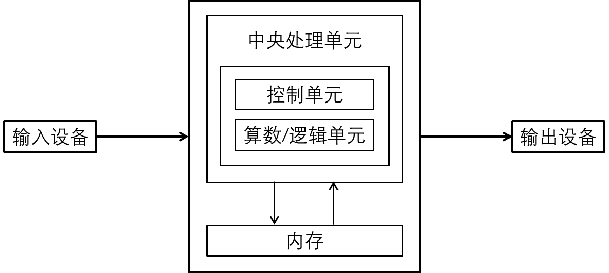

[TOC]

<div STYLE="page-break-after: always;"></div>

## Chapter 1：Introduction

### 1. 冯诺依曼结构

- The von Neumann Architecture

<div style='text-align: center'>

</div>

   - 输入：键鼠、扫描仪、麦克风
   - 输出：显示屏、打印机、音响
   - 内存

        - 容量比 disk 小，访问速度比 disk 快

        - volatile：断电后损失所有数据

        - 别称：main memory, primary memory, memory, RAM
   - 算数/逻辑单元
        - Arithmetic Logic Unit，简称 ALU

        - 负责加减乘除、比较大小、分支判断等

        - 常放在 CPU 中，是 CPU 的一部分

   - 中央处理单元
       - Central Processing Unit，简称 CPU
       - 告诉每个部分什么时候应该干什么
       - 多处理机：multiprocessors，一台电脑有多个 CPU
       - 多核处理器：multicore processor，在一个集成电路芯片中处理多进程
- 编程语言
  - 低级语言：计算机能直接运行
  - 高级语言：计算机不能直接运行，但是便于人类编写、读懂。需要 “翻译” 成低级语言才能使用
  - 编译器：compiler，扫描整个程序，把整个程序编译为机器码后交给执行器 executor 运行。
  - 解释器：interpreter，每次解释、执行一条语句，直到报错或运行完才停止。
  分析代码速度比编译器快，总体速度比编译器慢。

## Chapter 2：Java 应用程序

### 1. 注释

只要一行有双斜杠 `//`，双斜杠及其之后的内容都为注释。做题时可以全部删掉不看，无论后面的内容是什么。
三种注释举例：

```
//   /*  */
不报错
只是一个普通的单行注释

//   /*
           */
报错
第一行是单行注释，直接不看
第二行莫名出现一个 */，它找不到多行注释的前星号，所以报错
第一行的 /* 属于单行注释中的内容，不起作用

				
/*   */
            */
报错
多行注释的前星号会匹配最近的后星号，将中间的内容视为多行注释
此处前星号匹配第一行的后星号
第二行莫名其妙出现了个 */，所以报错
```

### <span id='identifier'>2. 标识符</span>

- 合法标识符可作为变量名、方法名、类名、接口名、枚举名
- 组成：
26 个小写字母 `a-z`, 
26 个大写字母 `A-Z`,
9 个数字 `0-9`,
美元符号 `$`, 
下划线 `_`
- 不能以数字开头
- 不能与 Java 自带的关键字冲突，如 `class` `while` `implements`（关键字不等于类名、不等于变量名）
- 以下均为合法标识符：`Main` `String` `$` `$__$` `static_`
- <i style='color:grey'>注：该知识点有争议，详见文件 “争议汇总”</i>

### 3. 主方法

```java
public class test{
	public static void main(String[] args){
		// ......
	}
}
```
- 如果将主方法的传入参数改成：
   |    改成什么    |   结果   |
   | :------------: | :------: |
   | `String[] arr` | 语法正确 |
   | `String arr[]` | 语法正确 |
   | `String... arr` | 语法正确（见[Chapter 6](#jump)） |
   |   `String s`   |    CE   |
   |  `int[] arr`   |    CE    |
   |    `int i`     |    CE    |
   |   `Object[] args`   | 不报错，但不识别为主方法 |
   
   规定：**主方法的方法签名为字符串数组**。
- 数组声明时，
方括号可以在元素类型后（`String[] arr`），
也可以在数组名后（`String arr[]`）。
 - 字符串数组的名字可以随便改
 - 命令行运行 Java 程序时， 运行指令的文件名后面跟的所有文字，会以空格作为分隔符，打包成字符串数组，传入主方法参数。
 如 `java test 1 2 3` 的主方法传入参数为 `["1", "2", "3"]`
    如果文件名之后没有非空字符串，则传入参数为长度为 0 的数组 `[]`，而不是 `null`。

### 4. 命令行

- 假设一个名为 `src` 的文件夹下有 `test.java`，可能还有其他文件。
	```
	src
	 ┠── test.java
	 ┠── 大学物理.txt
	 ┖── 离散数学.pdf
	```
	
- `cd xx/xx/xx/src`

  - 用命令行跳转到 `test.java` 所在的文件夹中
  - `cd` 是 “change directory” 的缩写，语法是 `cd + 文件夹路径`

- `javac test.java`

  - 用 `javac` 指令编译 `.java` 文件，注意命令中**有 `.java` 后缀**。
  - 运行后在当前目录下产生一个 `.class` 文件，是编译后的结果。
     编译后会忽略所有注释和多余空白符（tab、空格、回车等）。

      ```
      src
       ┠── test.class
       ┠── test.java
       ┠── 大学物理.txt
       ┖── 离散数学.pdf
      ```

- `java test`
  
  - 用 `java` 指令运行 `.class` 文件，注意命令中**没有 `.java` 后缀**.
  
- <i style='color:grey'>注：该知识点有争议，详见文件 “争议汇总”</i>

### 5. 八大基本数据类型

| 数据类型  | 二进制位数 | 默认值                           | 取值范围                              |
| :-------: | :--------: | :-----------------------------------: | ------------------------------------- |
|  `byte`   |   8 bits   | 0                     | $[-2^7 , 2^7-1]$                      |
|  `char`   |  16 bits   | `\u0000`<br>(`null`) | $[$`\u0000`$,$`\uFFFF`$]$             |
|  `short`  |  16 bits   | 0               | $[-2^{15} , 2^{15}-1]$                |
|   `int`   |  32 bits   | 0               | $[-2^{31} , 2^{31}-1]$                |
|  `long`   |  64 bits   | 0               | $[-2^{63} , 2^{63}-1]$                |
|`float`|32 bits|0.0|$\approx[-3.4\times 10^{38}, +3.4\times 10^{38}]$|
|`double`|64 bits|0.0|$\approx[-1.7\times 10^{308}, +1.7\times 10^{308}]$|
| `boolean` |  $?$ bits  | `f` | 根据 JVM 而定，可能 8-bits 可能 1-bit |

- 数据溢出后返回到最小值：
     ```java
     System.out.println(Interger.MAX_VALUE + 1);
     // 输出结果： -(2^(31))
     ```
- `char` 赋值可用 16进制，值为 16进制 对应的万国码（Unicode）编号的字符：
     ```java
     char c = '\uABCD';
     ```
- `char` 遇 数值比较、数学运算 时，自动转化了万国码表中对应编号的 `int` 数字。其余情况需要强制转换 `(int)c`。

### 6. 加减乘除

- 从最左边的数据类型开始，每次向右运算后，如果新的变量类型精确度更大，则结果会向上转型为精确度更高的数据类型。
     ```java
     print(1 + 2);         // int 3
     print(1.0 + 2);       // double 3.0
     print(1 / 2);         // int 0
     print(1.0 / 2);       // double 0.5
     print(5 / 3 * 2.5);   // double 2.5
	  // 5 / 3结果是 int 1，
	  // 2.5 是 double
       // int * double 变成 double
     ```
     
- 二元运算类型提升
     
     - 两个整数相加时，如果有至少有一个 `long`，则运算结果为 `long`，否则为 `int`。
     - 两个浮点数相加时，如果至少有一个 `double`，则运算结果为 `double`，否则为 `float`。
     - 浮点数与整数相加时，结果为浮点数类型
     - 特别提醒：
          - `short` + `short` = `int`
          - `short/int/long`  + `float` = `float`
          - `short/int/long` + `double` = `double`
     
- 任何数据类型遇到字符串后都转换成字符串。

     ```java
     print(1 + 1 + "_" + 1 + 1 + "_");
     // 输出：2_11_
     ```

 - 计算机只能存近似值，不能存精确值

     ```java
     double d = 0.2;
     // 不是精确的0.2，而是一个很接近0.2的、在小数点后很多位有误差的数
     for (int i = 0; i < 50; i++) {
         print(d);
         d = 1 - 4 * d;
     }
     // 输出：第一个是 0.2，然后逐渐偏离 0.2，最后变为正无穷
     ```

 - 此知识点考试不考：
     ```java
     print(3 * 0.1 == 0.3);
     // 输出：false
     ```
     与 Java 的浮点数表示和设计机制有关，远远超过本课范围，考试一定不会考。

## Chapter 3：控制语句 part 1

### 1. 伪代码

- 判分标准：能根据你的伪代码敲出代码
- 减少使用简单宽泛概述的话语
- 抱佛脚策略：写正常代码，但：省略所有大括号 `{` `}` ，赋值符号 `=` 改为左箭头 `←`，for 循环写为 `for i ← 0 to n`
- 注意缩进对齐

### 2. 三种结构

- 顺序：略
- 选择：`if`、`if-else`、`switch`、`boolValue ? yes : no`（三目运算符）
- 循环：`while`，`do-while`，`for`，`foreach`

### 3. counter-controlled repetition

用一个变量来控制循环次数，该变量被称为 counter 或 control value

```java
int c = 0;
while (c <= 10) {
	// ......
}
```

### 4. sentinel-controlled repetition

用一个特殊值表示循环结束，该值被称为 sentinel value

```
输入：1, 5, 8, 6, 9, 13, 17, -1
规定输入 -1 表示读取结束
```
循环次数不确定，也叫 indefine repetition

### 5.前后缀自增自减

<i style='color: grey;'>注：曾经有一学期出过极其变态的前后缀自增自减题，虽然被喷得体无完肤，以后也大概率不会出变态题，但是为了以防万一，此处依然将所有自增自减知识列出。请酌情考虑是否阅读。
</i>

<div style='color:red;font-weight: bold;'>
无论是前缀还是后缀，自增自减运算符的优先级始终高于赋值运算符。
</div>


术语 “内存” “操作数栈”：此处理解为两个不同的、互不干扰的存储设备即可。

此部分中，`操作数栈A` `操作数栈B` 单纯表示两个不同的操作数栈，编号 `A` `B` 没有特殊含义。

#### 5.1：语句中仅有 `++` 或 `--`

当一条语句中有且仅有一次 `++` 或 `--` 操作符时，前缀形式与后缀形式没有区别，直接对内存中的值进行加减。

```java
int a = 2;
a++;
print(a);	// 3

int b = 2;
++b;
print(b);	// 3
```

#### 5.2：`++` 或 `--` 的运算结果赋值给其他变量

##### 5.2.1：前缀

```java
int a = 2;
int b = ++a;
print(a);	// 3
print(b);	// 3
```
`a` 先变为 `3`，
把 `3` 复制到操作数栈，
把操作数栈中的 `3` 赋值给 `b`

##### 5.2.2：后缀

```java
int a = 2;
int b = a++;
print(a);	// 3
print(b);	// 2
```
一条语句用到变量的值时，
先把变量的值从内存中复制一份到操作数栈，使用值时从操作数栈中取值计算。

在上述代码中：

1. 把 `a` 的 `2`值 复制入操作数栈，
2. 在内存中把 `a` 加到 `3`
3. 从操作数栈中取出 `2` 值 赋值给 `b`

整个过程中，无论前后缀，都**先加减，再赋值**。平时听到的 “后缀：先运算后自增” 其实不严谨，应该是 “先引用后自增再运算”

##### 5.2.3：多个前后缀相加

此处以前缀相加举例。

```java
int a = 2;
int b = ++a + ++a;
print(a);	// 4
print(b);	// 7
```

b <span style='color: orange'>=</span> <span style='color: blue'>++a</span> <span style='color: red'>+</span> <span style='color: skyblue'>++a</span>

<div style='color: blue'>(i) a 变为 3</div>
<div style='color: blue'>(ii) 3 存入 操作数栈-A</div>		
<div style='color: skyblue'>(iii) a 变为 4</div>
<div style='color: skyblue'>(iv) 4 存入 操作数栈-B</div>
<div style='color: red'>(v) 操作数栈-A 中的 3 与操作数栈-B 中的 4 相加，得到 7</div>
<div style='color: orange'>(vi) 将 7 赋值给 b</div>

所以最后 `a` 为 `4`，`b` 为 `7`。

#### 5.3：`++` 或 `--` 的结果赋值给自身

##### 5.3.1：前缀

```java
int a = 2; 
a = ++a;
print(a);   // 3
```
1. 把 `a` 变成 `3`
2. 把 `3` 存入操作数栈，
3. 从操作数栈中取 `3` 赋值给 `a`

所以 `a` 最后为 `3`

##### 5.3.2：后缀

```java
int a = 2;
a = a++;
print(a);   // 2
```
1. 把 `a` 的 `2` 存入操作数栈
2. `a` 自增为 `3`
3. 用操作数栈中的 `2` 对 `a` 赋值

所以 `a` 最后为 `2`。
依然符合规律：**自增优先级始终高于赋值**。

##### 5.3.3：前后缀混合

```java
int a = 2;
a = ++a + a++;
print(a);   // 6
```
a <span style='color: orange'>=</span> <span style='color: blue'>++a</span> <span style='color: red'>+</span> <span style='color: skyblue'>++a</span>

<div style='color: blue'>
(i) a 变为 3<br>
(ii) 3 复制入 操作数栈-A
</div>
<div style='color: skyblue'>
(iii) 3 复制入 操作数栈-B<br>
(iv) a 变为 4
</div>
<div style='color: red'>
(v) 操作数栈-A 中的 3 与 操作数栈-B 中的 3 相加，得到 6
</div>
<div style='color:orange'>
(vi) 将 6 赋值给 a
</div>

所以 `a` 最后为 `6`

##### 5.3.4：复合赋值运算符

```java
int a = 2;
a += ++a + ++a;
print(a);   // 9
```
a <span style='color: orange'>+=</span><span style='color:skyblue'> ++a + ++a</span>
<div style='color: orange'>(i) 将 a 的值 2 存入 操作数栈-A</div>
<div style='color:skyblue'>(ii) 计算 += 右侧的结果 7，存入 操作数栈-B</div>
<div style='color:orange'>
(iii) 将 操作数栈-A 和 操作数栈-B 中的值相加得到结果 9<br>
(iv) 把结果 9 存入变量 a
</div>
**进行复合赋值运算时，会先把复合赋值运算符左边变量的值存入操作数栈**

所以 `a` 最后为 `9`

#### 5.4 字符自增自减

自增自减可用于：

- 整数类型：`byte`, `short`, `int`, `long`
- 浮点类型：`float`, `double`
- 字符类型：`char`

从 Java 5 开始，自增自减可用于上述类型的包装类：`Byte`, `Short`, `Integer`, `Long`, `Float`, `Double`, `Character`

```java
Character c = 'A';
c++;
System.out.println(c);	// 输出：字符 B
```

## Chapter 4：控制语句 part 2
### 1. 逻辑运算符

- 位运算：`&` `|` `^`（异或，两 bit 不同则为 1）
- 短路运算：

  - 适用条件：全部是 `&&` 或 `||`
  - 一旦能判断整个式子的真假值后，
    就不再继续判断后面的布尔表达式
  - 对比：`&` 和 `|` 会一直判断。

   ```java
   int b = 1, c = 0;
   if (b++ == c++ || true || b++ == c++) {
      print(c);   // 1
   }
   
   int d = 1, e = 0;
   if (d++ == e++ | true | d++ == e++) {
      print(e);   // 2
   }
   ```

### 2. 循环

#### 2.1：语法：`for(初始化; 布尔表达式; 更新)`

##### 2.1.1：初始化

- 初始化可以有多条语句，两两语句之间用逗号分隔。
- 初始化要么全部新建变量，要么全部给已有变量赋值，不能既赋值又新建变量。

```java
for (int i1 = 1, i2 = 2; i1 < 10; i1 ++) {
	// 初始化全部新建变量
}

int i3, i4 = 4;
for (i3 = 1, i4 = 1; i3 < 10; i3 ++) {
	// 初始化全部给已有变量赋值
}

// int i5;
// for (i5 = 5, int i6 = 6; i5 < 10; i5++) {
//    初始化中，新建变量和给已有变量赋值混合
// }
// 报CE

int i6 = 0;
for(i6 = 0; i6 < 10; i6++) ;
	System.out.println(i6);
// 输出 10
// 单个分号 ";" 是空语句，仍然是语句，符合 for 循环匹配规则
// 此处 for循环 匹配到空语句，作用仅是将 i6 从 0 加到 10
// 因此只会输出一次，且是最终值，而不是输出 10 次
// println 所在行的首行缩进为误导性陷阱
```

##### 2.1.2：更新

更新部分可以为多条语句，两两语句之间用逗号分隔。

```java
for (int i = 0; i < 10; System.out.println(i), i++) {
// 更新有两条语句，用逗号分隔
}   
```

#### 2.2：`while` 和 `do-while`

格式：

```java
while (..) {
	// ...
}   // 这里大括号之后没有分号

do {
	// ...
} while (..);  // 这里圆括号之后有分号
```
 `do-while`：至少执行 1 次
 `while`：可能执行 0 次

### 3. `switch`

下方代码中，`xxx`, `yyy`, `zzz` 分别代表不同的代码段。

```java
switch (i) {
   case 1 :
      xxx;
      break;
      // 语法正确，不报错
	  // 有 break，运行完 xxx 之后跳出 switch 结构
   default:
      yyy;
      // 语法正确，不报错
	  // 无 break，运行完 yyy 之后还会继续运行下方的 zzz
   case 2:
      zzz;
      // 语法正确，不报错
   // case i > 3:
   // 无法比较连续区间，报CE
}
```
- 只能用于以下数据类型的比较：`byte` `short` `int` `char` `String`

  <i style='color:grey'>注：该知识点有争议，详见文件 “争议汇总”</i>

- 只能用于比较离散数值，无法比较连续区间

- `case` 和 `default` 是标签，用于指定代码位置

- 若有相等的 `case` 数值：

  - 跳到对应的 `case` 标签处
  - 跳转后开始顺序执行，直到遇见 `break;` 或是走完 `switch` 结构体
  - 跳转之后标签不再影响代码运行

- 若无相等：

  - 跳到 `default` 标签处
  - 如果 `default` 没有则跳出 `switch` 结构体

- 用于比较 `char` 变量时，可以用整数作为 `case` 之后的常量，因为 `char` 遇数值比较会自动转化为 `int` 数字。
  ```java
  // 已知条件：字符 'a' 的万国码十进制编号为 97
  switch ('a'){
         case 97:
             System.out.println(1);
             break;
         default:
             System.out.println(2);
     }
  // 输出：1
  ```

### 4. `break` 和 `continue`

- `break`
  
  - 打破整个循环体
  - 即使后面有可以执行的循环，也不再执行
  - 不加标签则默认打破距离该语句最近的循环
  
    ```java
    Loop:
    for (int i = 0; i < 10; i++) {
        for (int j = 0; j < 10; j++){
            break Loop;
        }
    }
    // break 之后从这里开始执行
    ```
- `continue`：打破本次循环。
  会执行后面仍满足条件的循环。不加标签则默认打破距离该语句最近的循环。
    ```java
    Loop:
    for (int i = 0; i < 10; i++) {        // continue 之后从这里开始执行
        for (int j = 0; j < 10; j++){
            continue Loop;
        }
    }
    ```

## Chapter 5：数组

### 1. 创建数组

```java
int[] arr1 = new int[5];
int[] arr2 = new int[]{1, 2, 3, 4, 5};
int[] arr3 = {1, 2, 3, 4, 5};
int[] arr4;
arr4 =  new int[]{1, 2, 3, 4, 5};
int[] arr5;
arr5 = new int[5];
// 以上语法均正确

// int[] arr6;
// arr6 = {1, 2, 3, 4, 5};
// 该语法报错
```

### 2. 数组长度

- Java 语法：调用方法时需要有圆括号，调用成员变量没有圆括号
   |    类别    |      代码      |                 原因                  |
   | :--------: | :------------: | :-----------------------------------: |
   |  数组长度  |  `arr.length`  | `length` 是 `_Array_`类 中的成员变量  |
   | 字符串长度 | `str.length()` | `length()` 是 `String`类 中的实例方法 |
   |  链表长度  | `list.size()`  |   `size()` 是 `List`类 中的实例方法   |
   
   - 问：是否存在这样一种情况，对象名为 `list`，其内有个实例变量叫 `size()`。`list.size()` 其实是在调用变量？
   
     答：不可能。因为 `size()` 名字不符合[标识符命名规范](#identifier)。
- 数组长度被声明为 `public final int`，只能获取，不能修改
   ```java
   // arr.length = 1;
   // 该语句会报CE
   ```

### 3. 多维数组

```java
int[][] arr1 = new int[5][];
// int[][] arr2 = new int[][5];
int[][] arr3 = new int[5][6];
int[][] arr4 = { {0, 1},
                 {2, 3},
                 {4, 5} };
int[][] arr5 = new int[][]{ {0, 1},
                            {2, 3},
                            {4, 5} };
int[][] arr6 = { {1},
                 {2, 3, 4, 5},
                 {6, 7} };

print(arr6.length);     // 3
// 直接.length只看最外维
// 声明数组必须声明长度，多维数组的长度为最外面一层
// 所以arr1声明合法，arr2声明不合法
print(arr6[1].length);  // 4
```

### 4. 字面值

#### 4.1：定义

- 字面值是直接在代码中写的数字，例如 `int i = 1` 中等号右边的 `1`。

#### 4.2：整型字面值

- 直接写出的整数

- 整型字面值默认 `int` 类型，但是可以赋值给 `byte` `short` `char` `long` `int`。只要字面值在目标范围以内，Java 就会自动完成转换
- 如果试图将超出范围的字面值赋给某一类型，如把 `128` 赋给 `byte` 类型则报 CE
- 如果整数后面加上 `L` 或 `l` ，则表示该数字为 `long` 类型，如 `99999999999L`。

#### 4.3：浮点字面值

- 直接写出的小数

- 如果小数后面加上 `F` 或 `f` ，则表示该数字为 `float` 类型，如 `11.8F`。
- 如果小数后面什么都不加，如 `10.4`，或者小数后面加上 `D` 或 `d`，则表示该数字为 `double` 类型

#### 4.4：整型字面值前缀

- 所有涉及字母的前缀均**大小写不敏感**，可大写可小写也可以混搭，三者含义完全相同

- 不同前缀表示不同进制

- 如果以 `0b` `0` `0x` 为前缀表示不同进制，则必须为整型字面值，即 `0b` `0` `0x` 后面不能跟小数。

  |   开头    |   进制   |       举例        |                        备注                        |
  | :-------: | :------: | :---------------: | :------------------------------------------------: |
  | `0b` `0B` |  二进制  | `int b = 0b110;`  |                                                    |
  |    `0`    |  八进制  |  `int o = 0123;`  | 是数字 `0`(`\u0030`)<br>不是大写字母 `O`(`\u004F`) |
  | `0x` `0X` | 十六进制 | `int h = 0x90aB;` |                                                    |
  |   其他    |  十进制  |   `int d = 10;`   |                                                    |

- 所有进制的数字必须满足进制每一位的要求，超出范围会报错。

  如二进制每一位只能是 0 - 1，因此 `0b234` 会报错。

- 举例
   | 代码                  | 描述                                                         |
   | :-------------------- | :----------------------------------------------------------- |
   | `int b1 = 0b10`       | 二进制 `10`                                                  |
   | `int b2 = 0B01`       | 二进制 `01`                                                  |
   | `double b3 = 0b11.01` | 报错，整型字面值不能为小数                                   |
   | `int b4 = 0b12`       | 报错，二进制位不能为 `2`                                     |
   | `int b5 = 0b0`        | 二进制 `0`                                                   |
   | `int o1 = 0`          | **十进制 `0` **                                              |
   | `int o2 = 00`         | **八进制 `0` **                                              |
   | `int o3 = 000`        | 八进制 `00`                                                  |
   | `int o4 = 001`        | 八进制 `01`                                                  |
   | `double o5 = 012.34`  | **十进制 `12.34` **<br>前缀 `0` 跟小数表示十进制小数，不再是整型字面值 |
   | `int h1 = 0xaB01`     | 十六进制 `ab01`                                              |
   | `int h2 = 0xefg`      | 报错，十六进制位不能为 `g`                                   |
   | `long h3 = 0xal`      | **十六进制 `a`**<br>**`l` 表示转换为** `long` **数字**，而非该位为字母 `l`<br>末尾字符是小写字母 `l`(`\u006C`)，不是数字 `1`(`\u0031`) |
   | `long h4 = 0xaL`      | 同上一行                                                     |
   | `long h5 = 0xall`     | 报错，仅第一个 `l` 会判定为 `long` 后缀，至此字面值结束<br>之后的 `l` 等同于凭空出现，无法正常解析 |
   | `int h6 = 0xal`       | 报错，`long` 类型数字不能直接赋值给 `int` 类型               |
   | `int h7 = (int) 0xal` | 十六进制 `a`，先转换为 long 类型，然后强转为 int 类型，然后赋值。等价于 `int h6 = 0xa` |

## Chapter 6：方法

### 1. 值传递

**Java 里面只有值传递，没有引用传递**

#### 1.1：八大基本数据类型

传入的是值，不是变量

```java
 static void cube(int i) {
     i = i * i * i; 
 }

 public static void main(String[] args){
    int i = 2;
    cube(i);
    System.out.println(i);  // 2
 }
```
1.  `cube(i)` 将 `i` 的 **值`2`** 传入方法

2.  `static void cube(int i)` 接收到传入的 值`2`

3. `static void cube(int i)` 新建 `int` 类型变量 `i`，将接收到的值赋给变量 `i`

4.  此时的变量 `i` 仅在 `static void cube` 方法体里起作用，

   与主方法里的 `i` 是两个不同的变量，

   因此主方法里的 `i` 依然为 `2`。

#### 1.2：引用类型

- 除了八大基本数据类型以外的所有类型，都统称为 “引用类型”

- 对于引用类型的数据而言，修改和访问时，用到的是这个内存地址里面存的数据，因此方法里的修改可以同步到方法外。

    ```java
     static void change(int[] arr) {
         arr[0] = 100;
     }
    
     public static void main(String[] args){
        int[] arr = {0, 1, 2};
        change(arr);
        System.out.println(arr[0]);   // 100
     }
    ```

### 2. 变长参数列表

三个点 `...` 表示该形参为变长参数列表
```java
static void change1(int i) {} 
// 传入一个整型变量作为参数

static void change2(int[] arr) {}
// 传入一个整型数组作为参数

static void change3(int... arr) {}
// 传入一个变长参数列表作为参数
```

- 必须是三个点，不能多不能少
- 三个点必须紧挨左侧数据类型，与右侧变量名之间要有空格分隔
- 变长参数列表可接收 $\geq 0$ 个参数，所有参数必须均为声明的数据类型，否则报错
- 接收到的所有参数以数组形式赋给变量

   - 没有参数时，接收到的数据为长度为 0 的空数组 `[]`，而非 `null`

- 一个方法中，变长参数列表最多只能出现一次，且必须出现在末尾
- 变长参数列表本质是数组，编译时`int...` 等同于 `int[]`

   若类中还有一个与变长参数列表所在方法具有相同名字、参数顺序、参数类型的另一个方法，则二者不构成[方法重载](#overload)，会报错
- 代码举例：
   ```java
   static void change(int... arr) {}
   // static void change(int[] arr) {}
   // 对于编译器而言，int...等同于int[]，
   // 所以上述两个方法对编译器来说具有相同方法签名，
   // 会报错，二者不构成方法重载
   
   public static void main(String[] args){
      change(0, 1, 2);  // 接收到的数组：[0, 1, 2]
      change(0);        // 接收到的数组：[0]
      change();         // 接收到的数组：[]，是一个长度为 0 的空数组
   }
   ```


### <span id="jump">3. 主方法参数</span>

主方法参数中的 `String[] args` 是一个变长参数列表，但是特别允许在主方法里将 `...` 写成 `[]`，其他任何地方都不行。

```java
public static void main(String[] args){ ... }
// public static void main(String... args) { ... }
// 以上两种写法完全等价，不报错
```

### <span id='overload'>4. 方法重载</span>

- overload

- 方法签名 $=$ 方法名 $+$ 传入参数个数 $+$ 传入参数数据类型 $+$ 传入参数顺序

  不包括是否有返回值、返回值类型、传入参数变量名、方法是否静态
- 判断是否为方法重载：提取方法名和传入参数数据类型，看是否有相同的签名
- 方法重载：相同方法名、不同方法签名。使用时编译器根据方法签名定位调用的方法
- 举例：
   ```java
   int change(int[] arr) { return 1; }
   // 提取为 change(int[])
   
   int change(int x, int y) { return 1; }
   // 提取为 change(int, int)，与上面方法签名不同，属于方法重载
   
   // int change(int[] z) { return 1; }
   // 提取为 change(int[])，与第一个方法签名相同，会报错
   // 不看传入参数的名字
   
   // static int change(int[] arr) { return 1; }
   // 提取为 change(int[])，与第一个方法签名相同，会报错
   // 不看是否 static
   
   // void change(int[] arr) {}
   // 提取为 change(int[])，与第一个方法签名相同，会报错
   // 不看是否有返回值
   
   // double change(int[] arr) { return 1.0; }
   // 提取为 change(int[])，与第一个方法签名相同，会报错
   // 不看返回值类型
   
   // int change(int arr[]) { return 1; }
   // 提取为 change(int[])，与第一个方法签名相同，会报错
   // (int arr[]) 是 (int[] arr) 的另一种写法，二者等价
   
   // int change(int... arr) { return 1; }
   // 提取为 change(int[])，与第一个方法签名相同，会报错
   // 变长参数列表本质为数组，int... 等价于 int[]
   ```

### 5. 方法的返回值

- 方法的返回值可以是基本数据类型，也可以是引用类型

    ```java
    static int getOne() { 
        return 1; 
    }
    static int[] getArr() { 
        return new int[]{0, 1, 2, 3}; 
    }
    
    public static void main(String[] args){
        int i = getOne();
        System.out.println(i);                  // 1
        System.out.println(getArr().length);    // 4
    }
    ```

## Chapter 7+：见另一文件